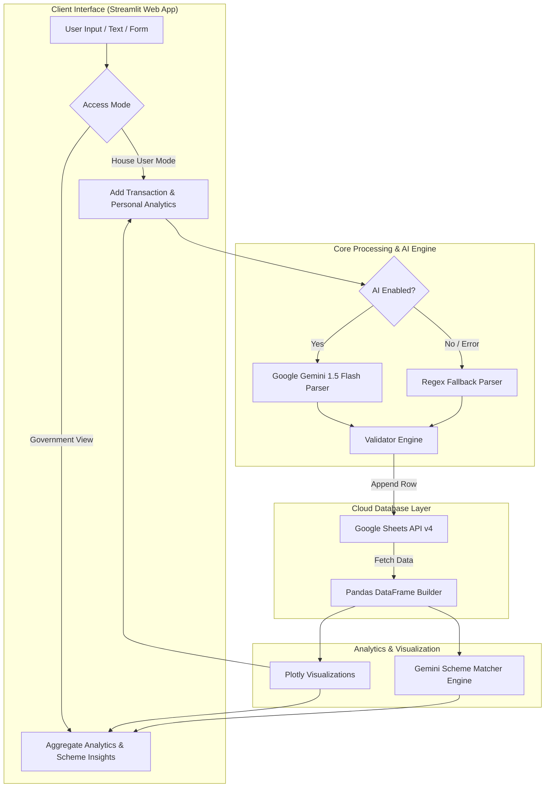

# 💎 Finora — AI-Powered Communal Finance Tracker & Panchayat Intelligence Platform

<div align="center">

[](https://www.python.org/)
[](https://streamlit.io/)
[](https://ai.google.dev/)
[](https://developers.google.com/sheets/api)
[](https://plotly.com/)
[](LICENSE)

**Empowering Rural Households & Municipal Administration with Natural Language Financial Tracking, Aggregated Community Analytics, and AI-Driven Government Scheme Matching.**

[Key Features](#-key-features--capabilities) • [Architecture](#-architecture--data-flow) • [Tech Stack](#-tech-stack) • [Quick Start](#-quick-start--installation) • [Environment Setup](#%EF%B8%8F-environment-variables-reference) • [User Guide](#-user-mode-guide) • [Contributing](#-contributing)

</div>

---

## 📌 Executive Summary & Overview

**Finora** is a state-of-the-art **AI-Powered Communal Finance & Intelligence System** engineered specifically for local administrative bodies (Panchayats, Municipalities, and Community Organizations) and their constituent households (scaling across 100 dedicated house profiles per unit).

In traditional rural and communal setups, micro-level household financial data remains opaque, preventing local government officials from understanding real-time community economic health, identifying financially stressed families, or deploying welfare schemes efficiently. 

Finora bridges this critical gap through a **dual-interface platform**:
1. **House User Access Mode**: Enables individual families to effortlessly log daily income and expenses using **natural language chat inputs** powered by **Google Gemini AI** or fallback regex parsing. Residents gain access to personalized interactive dashboards, sunburst spending breakdowns, and AI-powered financial advisory.
2. **Government / Panchayat Mode**: Provides municipal leaders and policy decision-makers with real-time aggregate community financial KPIs, cross-house expenditure heatmaps, monthly income vs. expense trends, and an **Automated AI Government Scheme Recommendation Engine** that dynamically matches spending patterns with Indian government welfare schemes (e.g., *PM Garib Kalyan Anna Yojana*, *Ayushman Bharat*, *PMAY*, *PM-Kisan*).

---

## 🔥 Key Features & Capabilities

### 🤖 1. Gemini AI Natural Language Transaction Parser
* **Zero-Friction Logging**: Users don't need complex forms. They can simply type natural text like *"Spent 450 rupees on vegetables and groceries today"* or *"Received 12000 freelance payment"*.
* **Automated Categorization**: Utilizes **Google Gemini 1.5 Flash** to extract standard structured fields: `Type` (Income/Expense), `Amount`, `Category`, `Subcategory`, and clean `Description`.
* **Resilient Rule-Based Fallback**: Integrates regex-driven parsing (`fallback_parse`) to ensure zero downtime even if AI connectivity is limited.

### 📊 2. Interactive Household Analytics Dashboard
* **Real-time Financial Metrics**: Live KPI cards displaying Total Income, Total Expenses, and Net Savings Balance with dynamic status deltas.
* **Sunburst & Line Visualizations**: Multi-layered Sunburst charts (Category -> Subcategory breakdown) and interactive line plots built with **Plotly Express**.
* **Personalized AI Financial Advisory**: Generates tailored monthly financial advice and micro-saving suggestions based on individual spending habits.

### 🏛️ 3. Panchayat Aggregate Intelligence & Heatmaps
* **Communal Economic Monitoring**: Combines financial activity across all 100 households in real time.
* **Expenditure Heatmaps**: Interactive House-vs-Category heatmap (`px.imshow`) identifying specific households spending heavily on healthcare, utilities, or education.
* **Panchayat Expense Pie Charts**: Visual distribution of overall communal expenditure.

### 💡 4. Intelligent Government Scheme Recommendation Engine
* **Context-Aware Matching**: Evaluates communal financial bottlenecks and matches households with relevant Indian government welfare initiatives.
* **Targeted Welfare Alignment**:
  * *High Food Expenses* ➔ Suggests **PM Garib Kalyan Anna Yojana (PMGKAY)**
  * *High Medical Costs* ➔ Suggests **Ayushman Bharat (PM-JAY)**
  * *Housing Maintenance/Rent* ➔ Suggests **Pradhan Mantri Awas Yojana (PMAY)**
  * *Agricultural Income Gaps* ➔ Suggests **PM-Kisan Samman Nidhi**

### 🔒 5. Serverless Google Sheets Cloud Persistence
* **Free & Scalable Storage**: Uses **Google Sheets API v4** as a real-time, transparent cloud database.
* **Automated Schema Provisioning**: `ensure_sheet_exists()` checks and initializes necessary worksheets and headers automatically on startup.
* **Enterprise Credentials Security**: Supports Google Cloud Service Account OAuth tokens and environment-masked keys.

---

## 🏗 Architecture & Data Flow



---

## 💻 Tech Stack

| Technology | Category | Purpose |
| :--- | :--- | :--- |
| **[Python 3.10+](https://www.python.org/)** | Programming Language | Core backend execution and data processing |
| **[Streamlit 1.31+](https://streamlit.io/)** | Web Framework | Dynamic multi-page web interface & interactive controls |
| **[Google Gemini 1.5 Flash](https://ai.google.dev/)** | Generative AI / NLP | Intelligent transaction parsing & custom financial insights |
| **[Google Sheets API v4](https://developers.google.com/sheets/api)** | Cloud Database | Multi-tenant cloud storage, schema auto-provisioning & data persistence |
| **[Pandas 2.0+](https://pandas.pydata.org/)** | Data Science | Data cleaning, time-series conversion, aggregate pivoting & metrics calculation |
| **[Plotly Express 5.14+](https://plotly.com/python/)** | Interactive Charts | Sunburst diagrams, time-series line graphs, community heatmaps & pie charts |
| **[Python-Dotenv](https://github.com/theskumar/python-dotenv)** | Configuration | Environment variable isolation and local `.env` handling |

---

## 📁 Repository Directory Structure

```text
Finora/
├── app.py                      # Primary Streamlit Entry Point & Navigation Controller
├── requirements.txt            # Python Dependencies Specification
├── .env.example                # Template for Environment Configuration
├── config/
│   └── settings.py             # Global Application Settings & Secrets Handler
├── core/
│   ├── logger.py               # Centralized Logging Service
│   ├── parser.py               # Fallback Regex NLP Parser
│   └── validators.py           # Data Validation & Schema Rules
├── services/
│   ├── ai_service.py           # Gemini AI Integration (Parsing, Advice & Scheme Insights)
│   └── sheets_service.py       # Google Sheets API Client & CRUD Operations
├── pages/
│   ├── Add_Transaction.py      # Natural Language Transaction Logging Page
│   ├── Analytics.py            # House-Level Personal Analytics Page
│   └── Aggregate_Analytics.py  # Panchayat-Level Government Analytics Page
├── credentials/
│   └── service_account.json.example  # Google Service Account Credentials Template
└── logs/
    └── finora.log              # Application Runtime Logs
```

---

## 🚀 Quick Start & Installation

Follow these steps to run **Finora** locally on your machine.

### 1. Prerequisites
- **Python 3.10** or higher installed.
- A **Google Cloud Platform (GCP)** project with Google Sheets API enabled and a Service Account key (`.json`).
- A **Google Gemini API Key** from [Google AI Studio](https://aistudio.google.com/).

### 2. Clone the Repository
```bash
git clone https://github.com/ananthram-dotcom/Finora.git
cd Finora
```

### 3. Set Up Virtual Environment
```bash
# Windows
python -m venv .venv
.venv\Scripts\activate

# macOS / Linux
python3 -m venv .venv
source .venv/bin/activate
```

### 4. Install Dependencies
```bash
pip install -r requirements.txt
```

### 5. Configure Environment Variables
Copy `.env.example` to `.env` and update the values:
```bash
cp .env.example .env
```

Edit your `.env` file:
```env
GOOGLE_CREDENTIALS_PATH=credentials/service_account.json
GOOGLE_SHEET_ID=your_google_sheet_id_here
ENABLE_AI=true
GEMINI_API_KEY=your_gemini_api_key_here
```

### 6. Set Up Google Service Account
1. Place your GCP service account JSON file at `credentials/service_account.json` (or set the path in `.env`).
2. Open your target Google Sheet in your browser.
3. Share the Google Sheet with the **client_email** found in your `service_account.json` (grant **Editor** permissions).

### 7. Launch the Application
```bash
streamlit run app.py
```
Open your browser at `http://localhost:8501`.

---

## 🎮 User Mode Guide

### 🏠 1. House User Mode
1. On the home page (`app.py`), select **House User**.
2. Select your house ID (from `1/100` to `100/100`).
3. Navigate to **➕ Add Transaction** in the sidebar.
4. Type transactions naturally (e.g., *"Spent 350 for medicine"* or *"Salary received 25000"*).
5. View personal analytics under **📊 My Analytics** to inspect sunburst charts, monthly balances, and AI advice.

### 🏛️ 2. Government / Panchayat Mode
1. Select **Government View** on the home page.
2. Navigate to **📊 Aggregate Analytics** in the sidebar.
3. Inspect total community income vs. expense metrics across all households.
4. Use the **House vs. Category Heatmap** to pinpoint high-spending households.
5. Review **AI Scheme Suggestions** to identify relevant government welfare programs.

---

## ⚙️ Environment Variables Reference

| Variable Name | Required | Default | Description |
| :--- | :--- | :--- | :--- |
| `GOOGLE_CREDENTIALS_PATH` | Yes | `credentials/service_account.json` | Path to GCP Service Account credentials JSON |
| `GOOGLE_SHEET_ID` | Yes | `""` | ID of the target Google Sheet for data persistence |
| `ENABLE_AI` | Optional | `false` | Enable/Disable Gemini AI functionality (`true`/`false`) |
| `GEMINI_API_KEY` | If AI enabled | `""` | Google Gemini API Key from Google AI Studio |

---

## 📈 Search Engine Optimization (SEO) & Key Highlights

This repository is optimized for indexability across search platforms for keywords including:
* *AI-Powered Panchayat Finance System*
* *Communal Financial Tracking Software*
* *Streamlit Finance Dashboard with Google Sheets*
* *Gemini AI Natural Language Expense Parser*
* *Indian Government Scheme Advisory Engine*
* *Rural Household Budgeting & Municipal Intelligence*

---

## 🤝 Contributing

Contributions are welcome! Follow these steps to contribute:
1. **Fork** the repository.
2. **Create** a feature branch (`git checkout -b feature/AmazingFeature`).
3. **Commit** your changes (`git commit -m 'Add some AmazingFeature'`).
4. **Push** to the branch (`git push origin feature/AmazingFeature`).
5. **Open** a Pull Request.

---

## 📄 License

Distributed under the **MIT License**. See `LICENSE` for more information.

---

<div align="center">
  <sub>Built with ❤️ for Empowering Rural & Micro-Community Financial Independence.</sub>
</div>
